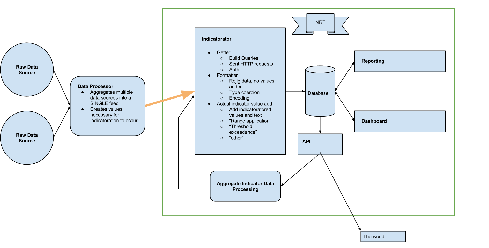

# Application overview
The NRT is a Node.js web application which consumes environmental data and
provides an interface for reporting on and managing the resulting indicators.

Environmental data can be consumed from a variety of data sources, providing
that data is made to conform to a structure. Different sources are supported
using the [adapter pattern](http://en.wikipedia.org/wiki/Adapter_pattern).

The reporting interface is a Backbone.js client-side application, which uses
Diorama for view nesting.

# Application data flow
Environmental data flows into NRT from the outside. It is expected that data
is ready to be transformed into an indicator when it reaches NRT. This data
must conform to the structure required by the adapter it is using
(e.g. CSV imports must conform to the CSV adapter).

Data starts of on the left side of the diagram, in its raw collected state.
Data is then collected and processed to be turned into an environmental
indicator with a single value. Once data conforms to an NRT adapter
specification, it can be imported into NRT. The 'Indicatorator' then performs
formatting, type coercion and, finally, optional threshold application. This
adds a text description to describe what the indicators raw value means, e.g. a
value of 28% might produce the value 'Good'.
Once this process has taken place, the indicator is stored in the MongoDB
database and it ready for use in the application.

# Application structure
The application is divided into 2 directories for the client and server
components.

## Server

### app.coffee

Application entry point. Includes required modules and starts the server

### route_bindings.coffee

Binds the server paths (e.g. '/indicators/') to the controllers in the controllers folder

### controllers/

Contains the 'actions' in the application, grouped into modules by their
responsibility. These are mapped to paths by route_bindings.coffee

### models/

Mongoose schemas, and model instantiation.

### libs/
Contains service objects, presenters and other libraries

## Client

A [BackboneDiorama](https://github.com/th3james/BackboneDiorama/) application
